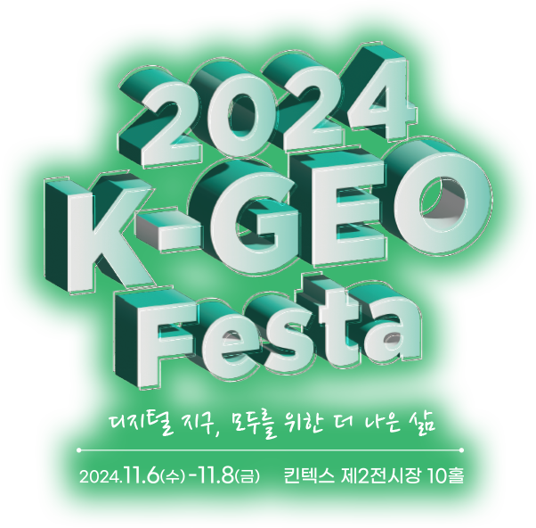

**[OSGeo Korean Chapter](https://www.osgeo.kr/)**의 연례 행사이자 대한민국 오픈소스 GIS 관련 최대 축제인 **FOSS4G Korea 2024** 행사를 개최합니다.

## ■ 행사 일정 및 장소
 - 기술 워크숍: 2024년 11월 28일(목)
 - 메인 컨퍼런스(구두발표) 및 연례총회: 2024년 11월 29일(금)
 - 장소: 서울시립대학교 법학관 5층 모의법정실

## ■ 진행중인 이벤트
 - 슬로건 공모 (완료):  ~ 10월 20(일) 18:00
 - 슬로건 선정 투표 (완료):  ~ 10월 27(일) 18:00
 - [기술워크숍 진행자 모집 (진행중)](https://forms.gle/LWUVb8XHhQAYiWA18): ~ 11월 10일(일) 18:00
 - 기술워크숍 참가자 모집 (예정):  ~ 11월 27일(수) 18:00
 - [구두 발표자 모집 (진행중)](https://forms.gle/REzVV2ekpeBQkwoS8): ~ 11월 10일(일) 18:00
 - [2024년 OSGeo 한국어지부 공헌상 후보자 추천 (진행중)](https://forms.gle/m18HTeEF5ocxXDcZ7): ~ 11월 10일 18:00
 - [행사 후원금 모집 (진행중)](https://foss4g.osgeo.kr/sponsor):  ~ 11월 20일(수) 18:00
 - [행사 및 뒷풀이 참가 등록 (진행중)](https://foss4g.osgeo.kr/register):  ~ 11월 24일(일) 18:00

## ■ 자원 봉사자 모집
- 행사 준비에 도움을 주실 분들은 주저하지 마시고 연락 부탁드립니다.
- SNS 홍보, 현장 등록 데스크 안내, 행사 진행에 도움을 주시면 됩니다.
- 문의: osgeo.kr @ gmail.com

## ■ 행사 후원 안내
 - 후원기관은 플래티넘 3인, 골드레벨 2인, 실버레벨 1인에 대해 워크숍 1세션 및 본 행사 참가비가 면제됩니다.
 - 후원 등급: 플래티넘(100만원), 골드(50만원), 실버(30만원), 개인(10만원)
 - 계좌 정보: 기업은행 931-028086-04-014 오에스지오한국어지부
 - 후원금 및 세금계산서 발행 문의: osgeo.kr @ gmail.com / 031-450-3411

FOSS4G Korea 후원 기관에는 다음과 같은 혜택이 주어집니다.

 - 기념품 무료 증정 - 플래티넘 3명, 골드 2명, 실버 1명
 - 워크샵 및 본 행사 무료 등록 - 플래티넘 3명, 골드 2명, 실버 1명
 - 뒷풀이 무료 참가 - 플래티넘 3명, 골드 2명, 실버 1명
 - 후원 회사 홍보물을 행사장 등에서 배포 지원
 - OSGeo 한국어 지부 FOSS4G Korea 행사 페이지에 로고 표시

## ■ 후원
후원해 주신 기관 및 개인 모두에게 진심으로 감사드립니다.

### ⊙ 플래티넘

### ⊙ 골드

### ⊙ 실버

### ⊙ 개인
남광우(국립군산대학교), 박은순(서울연구원), 최규성(신한항업), 손형수, 천정대, 유병혁(국립공원공단), 이용익(서울특별시), 이동훈(가이아쓰리디), 김선화(서울특별시)

## ■ 새소식 및 문의
행사 소식은 홈페이지, 메일링 리스트, 페이스북, 트위터 등을 통해 지속적으로 제공합니다.
 - [OSGeo Korean Chapter 메일링 리스트](http://groups.google.com/group/osgeo-kr)
 - [Facebook Group - OSGeo Korean Chapter](https://www.facebook.com/groups/OSGeoKR)

기타 문의사항은 [osgeo.kr@gmail.com](mailto:osgeo.kr@gmail.com) 또는 [OSGeo Korean Chapter Mailing List](http://groups.google.com/group/osgeo-kr)에 남겨주세요.

## ■ 조직위원회
[신상희](mailto:endofcap@gmail.com), [유병혁](mailto:bhyu@knps.or.kr), [최준영](mailto:novacite@gmail.com), [김지윤](mailto:aliasgis@gmail.com), [이준호](mailto:juno1238@gmail.com),
[강혜경](mailto:kang.krihs@gmail.com), [오동하](mailto:dongha@bdi.re.kr), [차승훈](mailto:kacgung@gmail.com), [윤정환](mailto:lenablue12@gmail.com), [최규성](mailto:kyusung.choi@gmail.com),
[정윤재](mailto:choung12osu@gmail.com), [권오균](mailto:kok02@lx.or.kr), [박재현](mailto:parkj73@gmail.com), [김윤지](mailto:jwithmango@gmail.com), [이민파](mailto:mapplus@gmail.com)

## ■ 행동강령
FOSS4G Korea 2024 참가자는 OSGeo 행동 강령에 따라 타인에 대해 정중하게 행동해야합니다. [OSGeo Code of Conduct](https://www.osgeo.org/code_of_conduct/).

## ■ 지난 행사
 - [FOSS4G Asia 2023](https://foss4g.asia/2023/)
 - [FOSS4G Korea 2022](https://foss4g.osgeo.kr/repository/2022/)
 - [FOSS4G Korea 2021](https://foss4g.osgeo.kr/repository/2021/)
 - [FOSS4G Korea 2020](https://foss4g.osgeo.kr/repository/2020/)
 - [FOSS4G Korea 2019](https://www.osgeo.kr/272)
 - [FOSS4G Korea 2018](https://www.osgeo.kr/258)
 - [FOSS4G Korea 2018년 이전](https://www.osgeo.kr/)

## ■ 주관

이 행사는 아시아 최대 공간정보 박람회 [K-GEO Festa](https://kgeofesta.kr/), 국내 유일 공간정보 전문 교육 기관 [LX 공간정보 아카데미](https://lxsiedu.or.kr)와 함께합니다.    

## ■ 특별한 감사

행사 장소를 제공해 준 서울시립대학교 공간정보공학과에 감사드립니다.

