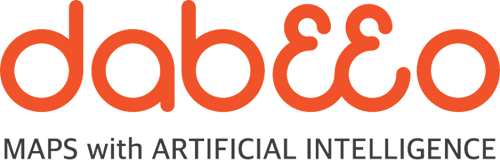
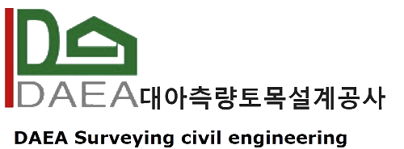
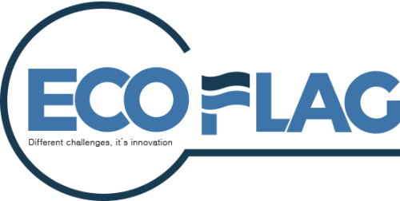

**[OSGeo Korean Chapter](https://www.osgeo.kr/)**의 연례 행사이자 대한민국 오픈소스 GIS 관련 최대 축제인 **FOSS4G Korea 2020** 행사를 **2020년 11월 12일부터 13일**까지 양일간 개최합니다.

이번 행사는 처음으로 **온라인**으로 개최할 예정이며, **한국어 트랙**과 **영어 트랙**으로 구분하여 진행합니다.

## ■ 행사 일정
2020년 11월 12일(목) ~ 13일(금)

## ■ 프로그램
온라인 기술 워크숍과 메인 컨퍼런스의 구두 발표는 온라인 웨비나 플랫폼(Zoom)을 이용해 진행합니다.
  - **[프레젠테이션 지침서](presentation-guidelines)**

### ⊙ 워크숍 데이
온라인 기술 워크숍은 오전, 오후 각 2회(13:00 ~ 16:00, 16:00 ~ 19:00)씩  4개의 주제로 진행합니다.

  - 일정: 11월 12일 13:00 ~ 19:00(Seoul, South Korea Time)
  - [워크숍 프로그램](workshop)

### ⊙ 온라인 컨퍼런스
온라인 컨퍼런스는 3개의 트랙(한국어 트랙, 영어트랙 1, 2)으로 진행합니다.

  - 일정: 11월 13일 10:00 ~ 18:00(Seoul, South Korea Time) 
  - [한국어 트랙 프로그램](track-korean)
  - [영어 트랙 1 프로그램](track-english-01)
  - [영어 트랙 2 프로그램](track-english-02)

### ⊙ 연례 총회
구두 발표가 끝난 후 우리 지부의 연례 총회를 개최 예정입니다. 올해 활동 내용, 재무정보, 올해의 활동가상 및 개발자상 수여식 등을 포함합니다.
  - 일정: 11월 13일 17:30(Seoul, South Korea Time) ~
  - [2020 연례 총회 - OSGeo Korean Chapter](https://docs.google.com/presentation/d/1tdGaq_xfQuu1uIYcz2EoC-nhbao-vWg3u8JHS2waG4Y/edit?usp=sharing)

## ■ 올해의 오픈소스 GIS 활동가상과 개발자상
2020년부터 OSGeo Korean Chpater에서는 OSGeo Korean Chapter 커뮤니티 회원들의 의견 수렴을 통하여
한 해 동안 한국어지부와 오픈소스 GIS 분야에서 기여한 2명을 대상으로 연례총회에서 **올해의 활동가상**과 **개발자상**을 수여합니다.

## ■ 새소식
행사 소식은 홈페이지, 메일링 리스트, 페이스북, 트위터 등을 통해 지속적으로 제공합니다.
  - [OSGeo Korean Chapter 메일링 리스트](http://groups.google.com/group/osgeo-kr)
  - [Facebook Group - OSGeo Korean Chapter](https://www.facebook.com/groups/OSGeoKR)
  
## ■ 참가비 및 후원금 모집
이번 행사는 별도의 참가비가 없으며, 자발적인 후원금 모집은 다음을 참고하세요.
  - 후원금 모집 마감일: 11월 6일
  - 후원금 및 세금계산서 발행 문의: [osgeo.kr@gmail.com](mailto:osgeo.kr@gmail.com) / 031-450-3411
  - 입금계좌: 기업은행 931-028086-04-014  / 예금주: 오에스지오한국어지부
  - [후원금 모집](sponsor)

## ■ 후원
후원해 주신 기관 및 개인 모두에게 진심으로 감사드립니다.  

### ⊙ 플래티넘

### ⊙ 골드

### ⊙ 실버

### ⊙ 개인
장윤정(서울시립대학교)

## ■ 조직위원회
[신상희](shshin@gaia3d.com), [유병혁](bhyu@knps.or.kr), [최준영](novacite@gmail.com), [김지윤](aliasgis@gmail.com), [이준호](juno1238@gmail.com),
[강혜경](hkkang@krihs.re.kr), [오동하](dongha@bdi.re.kr), [차승훈](kacgung@gmail.com), [윤정환](lenablue12@gmail.com), [최규성](kyusung.choi@gmail.com), 
[정윤재](choung12osu@gmail.com), [권오균](kok02@lx.or.kr), [이민파](mapplus@gmail.com)

## ■ 특별한 감사
행사 지원에 도움 주신 두 분 및 소속사에 진심으로 감사드립니다.
  - 로고 디자인 및 후원금 모집 팜플렛 제작: [SJ M&C(주)](https://www.sjmnc.kr/) 이다솔님
  - 후원금 관리 및 운영 지원: [(주)Mango System](http://www.mangosystem.com/) 김윤지님

## ■ 행동강령
FOSS4G Korea 2020 Online 참가자는 FOSS4G Korea 온라인 행동 강령에 따라 타인에 대해 정중하게 행동해야합니다. [Code of Conduct](code-of-conduct).

## 문의
[osgeo.kr@gmail.com](mailto:osgeo.kr@gmail.com) 또는 [OSGeo Korean Chapter Mailing List](http://groups.google.com/group/osgeo-kr)

