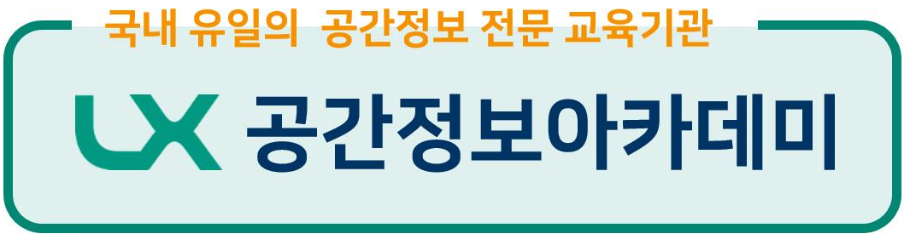

**[OSGeo Korean Chapter](https://www.osgeo.kr/)**의 연례 행사이자 대한민국 오픈소스 GIS 관련 최대 축제인 **FOSS4G Korea 2025** 행사를 개최합니다.

## ■ 전체 프로그램
 - [기술 워크숍](https://foss4g.osgeo.kr/workshop): 2025년 12월 5일(금) 09:00 ~ 12:00
 - [메인 컨퍼런스(구두발표) 및 연례총회](https://foss4g.osgeo.kr/conference): 2025년 12월 5일(금) 13:00 ~ 18:00
 - 장소: 서울 구로구 가마산로 242, 3층, LX 공간정보아카데미

## ■ 진행중인 이벤트
 - 행사 슬로건 공모 (마감)]:  ~ 10월 22일(수) 18:00 
 - 행사 슬로건 선정 투표 (마감):  ~ 10월 30일(목) 18:00 
 - 기술워크숍 진행자 모집 (마감):  ~ 10월 31일(금) 18:00 
 - 올해의 공헌상 후보자 추천 (마감):  ~ 11월 16일(일) 18:00 
 - 구두발표자 모집 (마감):  ~ 11월 24일(월) 18:00 
 
 
 - [후원금 모집 (진행중)](https://foss4g.osgeo.kr/sponsor):  ~ 11월 28일(금) 18:00  
 - [컨퍼런스, 뒷풀이 참가자 등록 (진행중)](https://foss4g.osgeo.kr/register):  ~ 12월 3일(수) 18:00  
 - [기술워크숍 참가자 모집 (진행중)](https://forms.gle/ByxsH3RTTf3jn4VM7):  ~ 12월 3일(수) 18:00

## ■ 참가 등록
 - 워크숍 + 컨퍼런스(기념품 증정) 등록과 뒷풀이(현장 3만원) 등록으로 구분
 - 후원기관 플래티넘 3인, 골드레벨 2인, 실버레벨 1인, 개인후원 1인에 대해 워크숍 1세션 및 본 행사 참가비 면제
 - [컨퍼런스, 뒷풀이 참가자 등록과 등록비용 납부 방법](https://foss4g.osgeo.kr/register)

## ■ 후원
후원해 주신 기관 및 개인 모두에게 진심으로 감사드립니다.
 - [후원금 모집 (진행중)](https://foss4g.osgeo.kr/sponsor):  ~ 11월 28일(금) 18:00

### ⊙ 플래티넘
 
 

### ⊙ 골드
 
 
 
 

### ⊙ 실버
 
 

### ⊙ 개인
이용익(서울특별시), 이동훈(가이아쓰리디), 남광우(국립군산대학교), 손형수(신한항업), 박천길(가이아쓰리디), 최규성(신한항업), 천정대(한국해양기상기술), 
박은순(서울연구원), 이봉주(서울특별시), 정은숙, 서세원(망고시스템), 김연준(더코어/팀스파르타), 김선호(한우테크), 김경룡(티처라인), 신봉조(띵스파이어)

## ■ 새소식 및 문의
행사 소식은 홈페이지, 메일링 리스트, 페이스북, 트위터 등을 통해 지속적으로 제공합니다.
 - [OSGeo Korean Chapter 메일링 리스트](http://groups.google.com/group/osgeo-kr)
 - [Facebook Group - OSGeo Korean Chapter](https://www.facebook.com/groups/OSGeoKR)

기타 문의사항은 [osgeo.kr@gmail.com](mailto:osgeo.kr@gmail.com) 또는 [메일링 리스트](http://groups.google.com/group/osgeo-kr)에 남겨주세요.

## ■ 조직위원회
[신상희](mailto:endofcap@gmail.com), [윤정환](mailto:lenablue12@gmail.com), [이민파](mailto:mapplus@gmail.com), [차승훈](mailto:kacgung@gmail.com), 
[최정주](mailto:jchoi@lx.or.kr), [박재현](mailto:parkj73@gmail.com), [김윤지](mailto:jwithmango@gmail.com), [정지수](mailto:stopsooya@gmail.com), 
[박소영](mailto:1124394@naver.com)

## ■ 행동강령
FOSS4G Korea 2025 참가자는 OSGeo 행동 강령에 따라 타인에 대해 정중하게 행동해야합니다. [OSGeo Code of Conduct](https://www.osgeo.org/code_of_conduct/).

## ■ 지난 행사
 - [FOSS4G Korea 2024](https://foss4g.osgeo.kr/repository/2024/)
 - [FOSS4G Asia 2023](https://foss4g.asia/2023/)
 - [FOSS4G Korea 2022](https://foss4g.osgeo.kr/repository/2022/)
 - [FOSS4G Korea 2021](https://foss4g.osgeo.kr/repository/2021/)
 - [FOSS4G Korea 2020](https://foss4g.osgeo.kr/repository/2020/)
 - [FOSS4G Korea 2019](https://www.osgeo.kr/272)
 - [FOSS4G Korea 2018](https://www.osgeo.kr/258)
 - [FOSS4G Korea 2018년 이전](https://www.osgeo.kr/)

## ■ 주관

이 행사는 국내 유일 공간정보 전문 교육 기관 [LX 공간정보 아카데미](https://lxsiedu.or.kr), 아시아 최대 공간정보 박람회 [K-GEO Festa](https://kgeofesta.kr/)와 함께합니다.    

## ■ 특별한 감사
  ※ 행사 장소를 제공해 준 [LX 공간정보 아카데미](https://lxsiedu.or.kr)에 감사드립니다.  
  ※ 행사 전반을 준비해 준 [(주)망고시스템](https://www.mangosystem.com/)에 감사드립니다.

